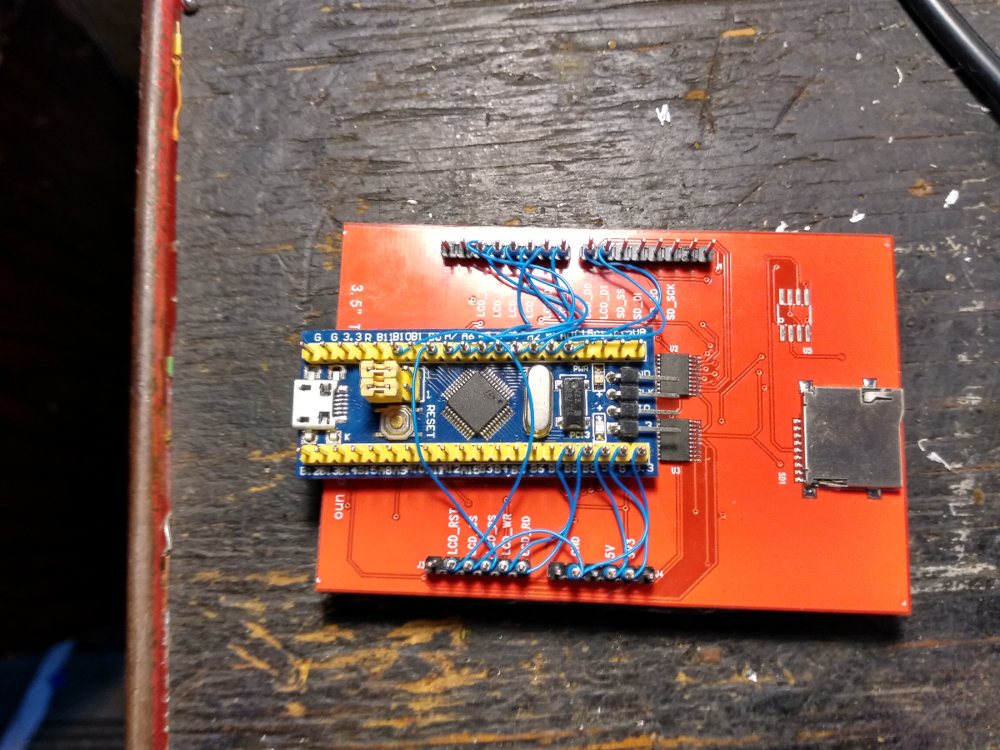
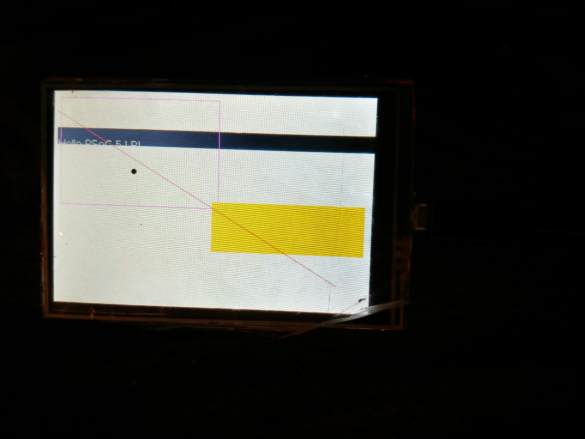

This firmware was part of a big ham radio project I was doing.I actually do not recommend this microcontroller for this lcd. The code works but the microcontroller is too slow.

Here are photo of my demo.

This is the modules wire wrapped together.

This is the display working.

